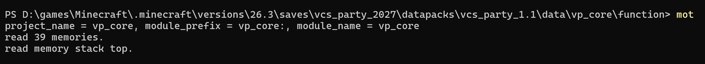
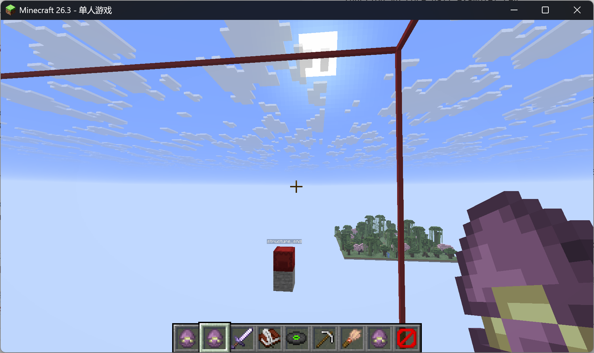
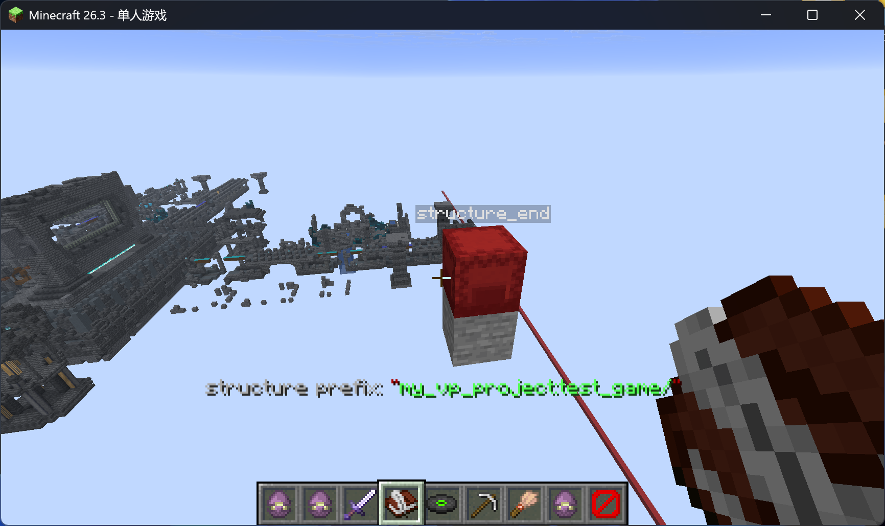
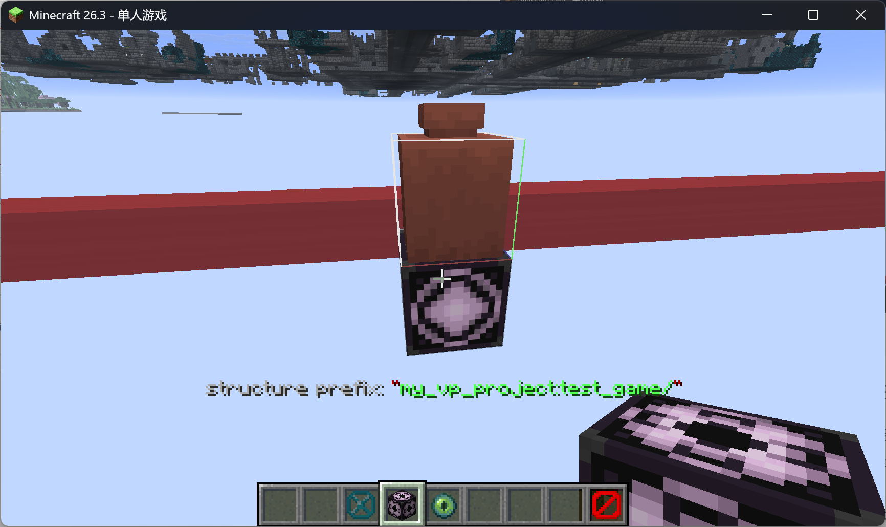
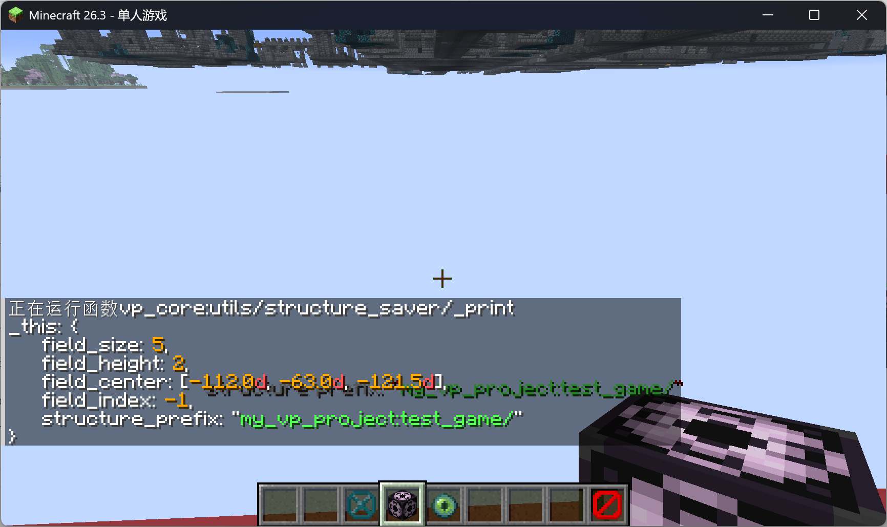
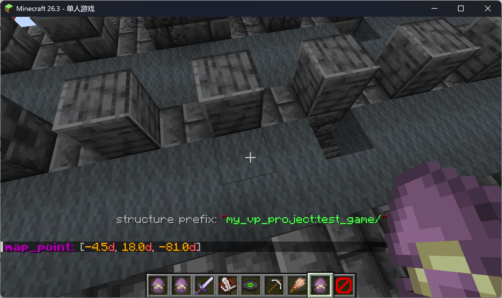

## vcs_party_1.1快速开始

### 1.安装模块构建器

确保您的电脑上有python3环境

在任意数据包的`function`目录下，按`Shift`+鼠标右键，在此处打开powershell窗口（或终端窗口）:

```bash
pip3 install mcf-mot
```

输入命令，检查`mot`是否可用:

```bash
mot
```

出现以下结果表明安装成功



*图1: mot运行成功*

结束mot运行

```bash
stop
```

> 如果系统寻找不到`mot`命令，请尝试打开python安装目录下的`Scripts`文件夹，将其添加到系统环境变量Path中

### 2.安装数据包

安装前置数据包[iframe_1.2](https://github.com/xiaodou8593/iframe_1.2)，放入存档`datapacks`文件夹

将本数据包放入存档`datapacks`文件夹

进入游戏存档，手动运行以下初始化命令：

```mcfunction
function iframe:_init
function vp_core:_init
```

运行以下命令加载预制大厅:

```mcfunction
function vp_core:hall_example/_reg
function vp_core:hall_example/_gen
function vp_core:hall_example/_enter
```

### 3.制作游戏场地

小游戏需要一个游戏场地。地形与建筑过程需要自行完成。

游戏场地的最低y坐标请不要低于-60，否则会影响结构工具的使用。

这里我们用古城作为演示。

```mcfunction
tp @s -100 0 -100
place structure minecraft:ancient_city -100 0 -100
```

获取结构工具包的iframe UI

```mcfunction
function iframe:_ienter {gui:"vp_core:guis/structure_manager"}
```

使用结构工具之前，请注意调整您的`选项/视频设置/模拟距离`，保证建筑结构始终处于加载范围内。

我们找到建筑结构的一条体对角线两个端点（与`fill`命令用法一致），分别放置`structure_start`和`structure_end`潜影贝。

如果潜影贝放错位置，可以用铁剑杀掉，也可以在正确位置直接放一个新的（旧的自动清除）



*图2: 结构范围*

建筑结构的范围，已经使用红色边框完成了标识。

我们右键打开`input structure prefix`书与笔，输入结构的命名前缀。

例如您的小游戏路径是命名空间`my_vp_project`下的`test_game`，这里输入的前缀是`my_vp_project:test_game/`



*图3：结构前缀*

然后我们右键`save structure`唱片，进入保存结构的子UI

1. 右键点击`next structure block`工具，生成一个结构方块
2. 右键点击`teleport to structure block`工具，传送到结构方块位置
3. 右键打开结构方块，点击保存
4. 回到1重新执行123，处理下一个结构方块，直到出现图4所示陶罐
5. (陶罐用于记录场地元信息) 右键打开结构方块，保存这个陶罐
6. 敲掉最后一个结构方块



*图4：元信息陶罐*

最后我们调用打印函数，输出场地信息

```mcfunction
function vp_core:utils/structure_saver/_print
```



*图5：场地信息*

游戏场地已经制作完毕，右键屏障退出所有iframe UI即可。

### 4.制作小游戏模块

我们回到`datapacks`文件夹，新建一个数据包，命名空间使用上一部分中的`my_vp_project`

我们打开存档下的`generated`文件夹，将保存的结构文件移植到新建的数据包内：将`generated/my_vp_project/`的`structure`文件夹剪切并粘贴到数据包的`data/my_vp_project`目录下即可

在`data/my_vp_project`内创建`function/test_game`目录，进入`test_game`目录

按`Shift`+鼠标右键，在此处打开`powershell`或终端，运行`mot`，依次输入以下命令：

```bash
push vp_mem_1.0
mcfo
run
init
sync
stop
pop
stop
```

打开`_reg.mcfunction`，第18~20行填写游戏场地信息

```mcfunction
...
data modify storage vp_core:io field_size set value 5
data modify storage vp_core:io field_height set value 2
data modify storage vp_core:io field_center set value [-112.0d,-63.0d,-121.5d]
...
```

### 5.游戏开始条件检查

打开`_enter_check.mcfunction`和`_start_check.mcfunction`，编写游戏开始条件（前者用于游戏加载之前做检查，后者用于游戏加载完毕之后做检查）

我们这里修改为仅需1人开始游戏

```mcfunction
...
execute if score temp_cnt int matches 1.. run scoreboard players set res int 1
```

### 6.游戏玩家初始化

打开`_set_player.mcfunction`，你可以在这里初始化玩家的属性和游戏数据。

`_set_player`函数默认为玩家设置了`death_func`和`respawn_func`两个回调函数，分别用于游戏过程中的死亡和复活动作。

打开`_get_tp_points.mcfunction`，你可以在这里设置玩家的初始传送点（在列表中随机挑选），传送点坐标由场地相对坐标来表达。

这里讲解如何获取场地相对坐标：

重新进入我们的结构工具包UI

```mcfunction
function iframe:_ienter {gui:"vp_core:guis/structure_manager"}
```

在上一节制作的场地结构中，放置一个`map_point`潜影贝，聊天栏输出的即是该位置的相对坐标，你可以在游戏日志中复制粘贴。



*图6：相对位置坐标*

> 你可能并不希望使用初始随机传送点，那么忽略`_get_tp_points`即可，在下一节的`start_game`函数中实现自定义的初始传送逻辑。

### 7.游戏流程设计

`main.mcfunction`是游戏的主程序，它默认实现了以下状态机：

* `prepared`：游戏刚刚加载完毕，立即执行`start_game`函数，执行游戏开始动作，下一刻跳转到`running`状态
* `running`：游戏进行中，调用`running`函数，如果满足胜利条件则下一刻跳转到`rewarding`状态；如果满足强制结束条件则下一刻跳转到`over`状态
* `rewarding`：奖励进行中，播放烟花效果，为胜利玩家发放绿宝石奖励，结束后跳转到`over`状态
* `over`：不被main处理，用于告知`vp_core`游戏已经结束，由`vp_core`来调度游戏实例的销毁、玩家返回大厅

你可以在上述`start_game`函数中编写游戏开始动作，在`running`函数中编写游戏主逻辑，在`rewarding`调用的`gain_emerald`函数中设置胜利玩家获取绿宝石数量（默认10~15颗）

在`running`中强制结束游戏，只需要运行以下代码（意味着状态机下一刻跳转到`over`）

```mcfunction
data modify storage vp_core:io game_state set value "over"
```

在`running`中触发游戏胜利，只需要运行以下代码（意味着状态机下一刻跳转到`rewarding`）

```mcfunction
tellraw @a ["",{"text":"winner: ","color":"gold","bold":true},{"selector":"胜利玩家选择器","color":"gray"}]
data modify storage vp_core:io game_state set value "rewarding"
# 奖励计时器
summon marker 0 0 0 {Tags:["vp_rewarding"],CustomName:"vp_rewarding"}
scoreboard players set @e[tag=vp_rewarding,limit=1] killtime 300
```

并打开`rewarding`函数，将第10行修改为胜利玩家选择器，传入`gain_emerald`函数

**你可能还需要：**

**获取游戏中的所有玩家**

```mcfunction
say @a[tag=vp_gamer]
```

**访问游戏场地中的一个位置**

```mcfunction
data modify entity 0-0-0-0-0 Pos set from storage vp_core:io field_center
execute at 0-0-0-0-0 positioned ~<x> ~<y> ~<z> run particle flame
```

或

```mcfunction
execute store result score temp_x int run data get storage vp_core:io field_center[0] 10000
execute store result score temp_y int run data get storage vp_core:io field_center[1] 10000
execute store result score temp_z int run data get storage vp_core:io field_center[2] 10000
execute store result storage math:io xyz[0] double 0.0001 run scoreboard players add temp_x int <x>
execute store result storage math:io xyz[1] double 0.0001 run scoreboard players add temp_y int <y>
execute store result storage math:io xyz[2] double 0.0001 run scoreboard players add temp_z int <z>
data modify entity 0-0-0-0-0 Pos set from storage math:io xyz
execute at 0-0-0-0-0 run particle flame
```

此处的`<x>, <y>, <z>`正是场地相对坐标。

如果您不需要游戏场地的可迁移性，也可以直接使用世界绝对坐标。

**玩家死亡/复活动作**

编写`death_func.mcfunction`/`respawn_func.mcfunction`即可

### 8.游戏实例销毁

`_del_async_start.mcfunction`是游戏的销毁程序。游戏中产生的各类资源，如`bossbar`、`team`、`scoreboard`、`waypoint`等可以在此处删除。

游戏中产生的所有实体也需要销毁，你可以为它们打上`vp_instance`标签来实现自动销毁。