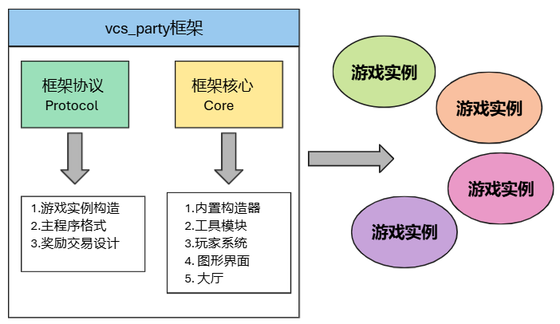
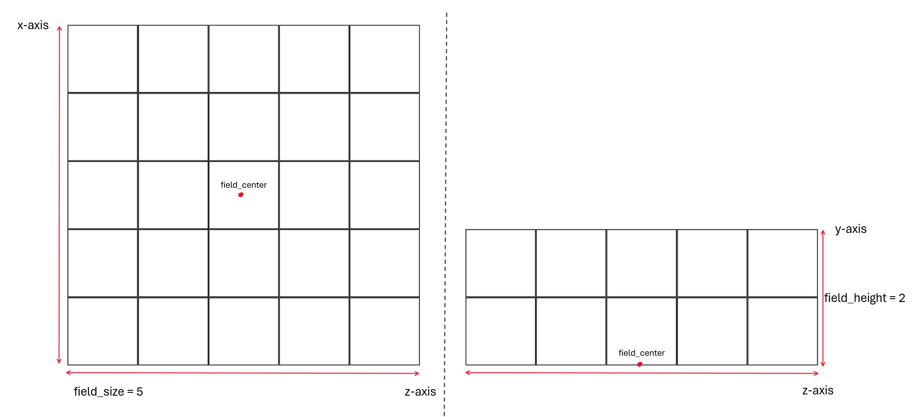
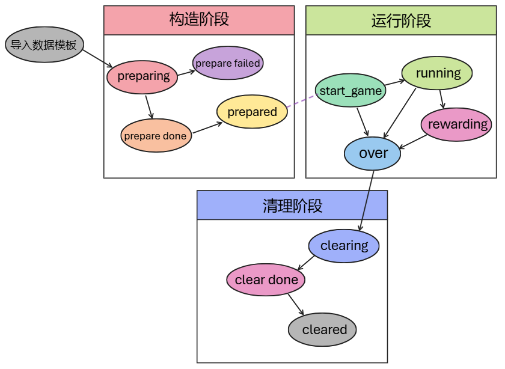

# vcs_party_1.1使用文档

&gt; 适用版本：1.21.11 \~ (?)  
&gt; 前置依赖：iframe_1.2  
&gt; 命名空间：vp_core, module_control

---

## 1.基本介绍

### 什么是vcs_party？

vcs_party是一款适用于原版mc数据包开发的派对小游戏框架，包括框架协议与框架核心两部分。

其中，框架协议规定了一个派对小游戏模块应遵循的形式，包括游戏实例的构造、主程序格式、奖励与交易设计。

框架核心则用于组织每一场派对小游戏的选择、运行、结算，并管理游戏玩家的加入、退出。



*图1：vcs_party框架概览*

### 可以用vcs_party来做什么？

* 模板化创作派对小游戏
* 分享不同作者的派对小游戏
* 组织游玩派对小游戏

## 2.框架协议

框架协议支持mot_2.0推送，请下载并运行mot_2.0: https://github.com/xiaodou8593/mot_2.0  
~~将memory_storage文件夹中的记忆模板(vp_mem_1.0, vp_constructor_1.0, vp_hall_1.0)复制到mot_2.0本体的memory_storage文件夹即可。~~（新版本mot无需该操作，确保datapacks文件夹中有vcs_party数据包即可）

请寻找一个目录作为小游戏模块，它必须位于data/命名空间/function或更下层。

如果您想要创建新的数据包以及模块，在datapacks文件夹下按ctrl+p，输入数据包名称和命名空间即可，模块目录会自动打开。(如果使用已有数据包请忽略)

打开您的模块目录后，按ctrl+m运行mot_2.0记忆栈，推送记忆模板

```
push vp_mem_1.0
```

### 基本信息与载入

在模块目录下按ctrl+o创建对象格式文档，一个派对小游戏(vp_game)必须包含以下字段 (mot已自动完成填写)：

```
_this:{
	game_namespace:[storage vp_core:io game_namespace,String],
	game_prefix:[storage vp_core:io game_prefix,String],
	game_name:[storage vp_core:io game_name,Compound],
	game_desc:[storage vp_core:io game_desc,ListCompound],
	game_display:[storage vp_core:io game_display,Compound],
	version_range:[storage vp_core:io version_range,ListInt,2],
	game_state:[storage vp_core:io game_state,String],
	field_size:[storage vp_core:io field_size,Int],
	field_height:[storage vp_core:io field_height,Int],
	field_center:[storage vp_core:io field_center,ListDouble,3]
}
```

在mot记忆栈中加载所有的小游戏模块预设接口

```
run
init
sync
stop
pop
stop
```

编辑模块目录下的_reg接口完成信息载入。

* game_namespace用于设置小游戏命名空间，mot_2.0已经自动设置完成。
* game_prefix用于设置小游戏模块前缀，mot_2.0已经自动设置完成。
* game_name用于设置小游戏的名称
* game_desc用于设置小游戏的介绍
* game_display用于设置小游戏图标资源的数据模板，vp_core提供了两种图标展示方式：item_icon和head_pic
* version_range用于设置小游戏适用的mc最低版本和最高版本，使用数据版本格式 (在聊天栏中使用命令/data get entity @s DataVersion可以获取对应mc数据版本)
* game_state用于设置小游戏进行状态，在此处应填写"preparing"
* field_size用于设置小游戏场地大小，单位是48×48的结构方块区域。
* field_height用于设置小游戏场地高度，单位是48格。
* field_center用于设置小游戏场地中心，定义为场地最底层的中心坐标。该项置零即可，游戏加载时由vp_core来分配。

field_size, field_height, field_center示意图如下：



*图2：场地尺寸设计*

关于game_display的文档请参考[图标资源](./docs/game_display.md)

### 游戏实例的构造

vp_game游戏实例是由多个不同的构造器，在异步过程中建造出来的。

关于构造器的文档请参考[构造器](./docs/constructor.md)。

打开模块目录下的_build_async_start接口，在该接口中生成游戏实例所需的全部构造器。

该接口默认包含了以下内置构造器：chunk_loader, area_clear, structure_builder, barrier_builder, player_setup, player_teleport，用于区块加载、场地清空、结构生成、空气墙生成、玩家设置、玩家传送任务。

player_setup构造器异步调用了模块目录下的_set_player接口，编辑该接口，实现游戏中的玩家设置逻辑。

player_teleport构造器调用了模块目录下的_get_tp_points接口，编辑该接口，设置游戏地图中有哪些传送点 (以field_center为基准的相对坐标)

打开模块目录下的_build_async_main接口，在该接口中实现构造器的运行次序逻辑。

```
# 构造器是否还在运行
execute store result score temp_cnt int if entity @e[tag=vp_constructor,tag=running]
execute if score temp_cnt int matches 1.. run return fail
# 构造器时序
execute as @e[tag=vp_constructor,tag=chunk_loader] run return run tag @s add running
execute as @e[tag=vp_constructor,tag=area_clear] run return run tag @s add running
execute as @e[tag=vp_constructor,tag=structure_builder] run return run tag @s add running
execute as @e[tag=vp_constructor,tag=barrier_builder] run return run tag @s add running
execute as @e[tag=vp_constructor,tag=player_setup] run return run tag @s add running
execute as @e[tag=vp_constructor,tag=player_teleport] run return run tag @s add running
# 构造完成
data modify storage vp_core:io game_state set value "prepare done"
```

由于构造器在运行结束后会自动销毁，因此当running标签的构造器消失后，只需选择一批新的构造器，打上running标签，然后return即可。上下文不同的return顺序，决定了构造器的运行次序。这种设计当然也允许多个构造器同时运行。

**游戏实例的析构：** 模块目录下_del_async_start, _del_async_main接口用于析构游戏实例。为保证游戏实例中所有的实体对象销毁成功，请为它们标记vp_instance标签。

拥有vp_instance标签的实体对象：

* 如果已注册module_control模块中的module_id，则调用自己模块目录下的_del接口完成销毁。
* 否则直接使用kill命令完成销毁。

### 主程序格式

模块目录下的main函数是游戏实例的主程序。它是一个运行在vp_game临时对象上的状态机。

主程序模板默认处理了以下三种游戏状态：

* start_game: 游戏开始设置，检查是否满足游戏开始条件，直接跳转到running或over状态
* running: 游戏主要逻辑，检查游戏结束条件，如果满足跳转到rewarding或over状态
* rewarding: 游戏结算逻辑，发放本局游戏奖励给指定玩家，跳转到over状态

start_game调用了模块目录下的_start_check接口，编辑该接口实现游戏开始检查逻辑。与_start_check接口区分的是_enter_check接口，前者检查发生在游戏实例构造完成后，而后者检查的是游戏进入条件，也即游戏实例能否构造。

running实现游戏运行的主要逻辑，以及结束逻辑。在running状态下，当胜利条件满足，下一刻跳转到rewarding状态时，会额外生成一个vp_rewarding实体，它的killtime是300，这用于控制rewarding状态的运行时间。

rewarding获取vp_rewarding实体的killtime，在不同的时刻运行不同的奖励逻辑，并生成奖励效果 (默认预设了烟花效果)。在模板中默认奖励胜利的1名玩家，模块目录下的gain_emerald函数编辑绿宝石奖励数量。



*图3：游戏实例状态机*

### 奖励与交易设计

vcs_party框架流通的货币：绿宝石。玩家参与游戏，胜利后可获得绿宝石奖励。玩家可以使用绿宝石购买小游戏纪念品。这些纪念品可以在大厅，或者游戏中随时调取使用。

为保障游戏经济平衡，vcs_party协议对绿宝石奖励的数量和功效做出了约束：

1. 一局小游戏胜利后，奖励的绿宝石总量在区间 $[10,15]$ 以内。多名玩家胜利，则应该分配这些绿宝石总量。
2. 绿宝石能够购买的纪念品具有分级设计，包含以下几个等级：
  
* 普通级，价格区间 $[30,50]$
* 稀有级，价格区间 $[70,90]$
* 传说级，价格区间 $[150,170]$
* 史诗级，价格区间 $[310,330]$

关于绿宝石模块的使用，请参照[绿宝石](./docs/emerald.md)。

关于纪念品的制作与注册，请参照[物品协议](./docs/item_protocol.md)和[纪念品](./docs/souvenirs.md)。

## 3.框架核心

下载并安装前置依赖iframe_1.2：https://github.com/xiaodou8593/iframe_1.2

初始化vcs_party内核及其前置依赖：

```
function iframe:_init
function vp_core:_init
```

### 内置构造器

* chunk_loader：用于区块加载任务，参照[chunk_loader](./docs/constructor.md#chunk_loader)
* area_clear：用于场地清空任务，参照[area_clear](./docs/constructor.md#area_clear)
* structure_builder：用于结构生成任务，参照[structure_builder](./docs/constructor.md#structure_builder)
* barrier_builder：用于空气墙生成任务，参照[barrier_builder](./docs/constructor.md#barrier_builder)
* player_setup：用于玩家设置任务，参照[player_setup](./docs/constructor.md#player_setup)
* player_teleport：用于玩家传送任务，参照[player_teleport](./docs/constructor.md#player_teleport)

### 内置工具模块

* chunk_area：用于兼容性区块加载，参照[chunk_area](./docs/chunk_area.md)
* firework_shooter：用于发射烟花效果，参照[firework_shooter](./docs/firework_shooter.md)
* game_control：用于控制全局游戏实例，参照[game_control](./docs/game_control.md)
* structure_saver：用于结构保存加载，参照[structure_saver](./docs/structure_saver.md)

### 内置玩家系统

* 玩家空间：参照[玩家空间](./docs/player_sys.md#玩家空间)
* 玩家模型：参照[玩家模型](./docs/player_sys.md#玩家模型)
* 工具函数：参照[工具函数](./docs/player_sys.md#工具函数)

### 内置用户界面

* structure_manager：图形化管理区块保存加载，包括子界面（structure_saving, structure_building），参照[structure_manager](./docs/guis.md#structure_manager)

### 内置游戏大厅

* 大厅协议：参照[大厅协议](./docs/hall_protocol.md)
* 大厅抽象类：参照[大厅抽象类](./docs/hall.md)
* 内置大厅：参照[内置大厅](./docs/hall_example.md)

## 4.案例实战

* 个人游戏实战：[实战案例1——饥饿游戏](./docs/game_example_1.md)
* 组队游戏实战：[实战案例2——起床战争](./docs/game_example_2.md)